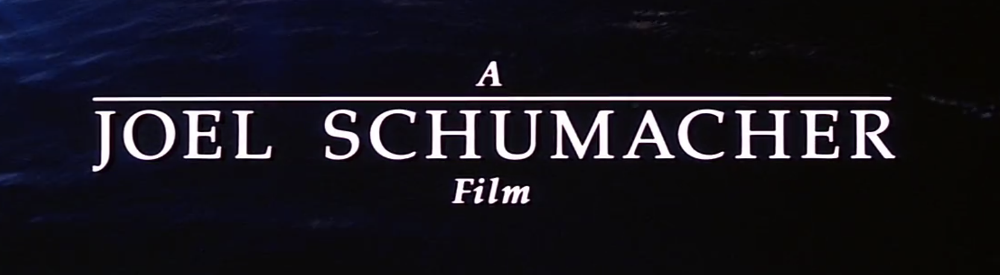

I watched <i>The Lost Boys</i> towards the end of last year, because it was on the “Leaving HBO this month” list, and it’s one of my mom’s favorite movies. And I was so surprised and delighted by it – it’s very raunchy for my mom’s wheelhouse, but it’s also very sweet and funny and just the right amount of genuinely scary. I had seen bits of it before, but I had no clue how much I would love it. Anyway, I was re-watching it again before HBO took it away at the end of November, and this was the first thing that flashed on screen:

Huh, I didn’t realize the first time I watched, but this name seemed really familiar. I couldn’t go on not knowing why it seemed familiar, and:

!!! Thank you, Joel, for taking a break from directing the Val Kilmer/George Clooney Batman movies and [the music video for “Kiss from a Rose”](https://www.youtube.com/watch?v=AMD2TwRvuoU) to make two exquisite films. (He also made <i>St. Elmo’s Fire</i>, which is very similar to The Lost Boys in that my mom loves it but deemed it too raunchy for me to watch as a teen. I still haven’t seen it, but last year I had a song stuck in my head for like two weeks and sent a recording of myself humming it to my mom to identify, and it turned out to be [the title song from <i>St. Elmo’s Fire</i>](https://www.youtube.com/watch?v=dx7vNdAb5e4). It’s also in <i>Spider-Man: Into the Spider-Verse</i>, which is probably how it slithered into my head.)

Anyway, this <i>Phantom</i> connection made me want to watch and discuss this movie with my best friend, with whom I share a semi-ironic but also entirely sincere love of the Opera Ghost. We exchange movie recaps pretty frequently, so that’s why I initially wrote this. It also made me feel so much love for my mom – who would have thought that we’d both be weirdly obsessed by movies that were made by the same director sixteen years apart?

The soundtrack to this film is A JOY. It’s a full 80s-style soundtrack rather than a score, a lot of it made specifically for this movie and therefore specifically about moody vampires. The opening shots over the ocean and a boardwalk are all under the main theme, which sings sexily about sin and features a chorus that’s all air drums and a children’s choir singing the ten commandments. It’s truly a banger, and I listen to it all the time now. AND IT’S NOT EVEN THE BEST SONG ON THE SOUNDTRACK! Not by a longshot!

While that plays, we zoom in on a boardwalk full of hot but seedy 80s teens. It’s here that Kiefer Sutherland makes his entrance: 

My mom had a poster of his face in her dorm room. I had seen pictures of him in this movie, but I did not get the attraction until I saw him in motion. He is extremely compelling. This movie was built for the androphile gaze – there is almost never not a very attractive man on screen. Except for during the lighthearted parts about tween vampire hunters, which provide a much-needed breather from the very attractive onscreen men. And even those are probably built for the teenybopper androphile gaze.

Anyway, Kiefer and a bunch of less-hot-but-still-quite-hot grungy 80s rats hassle some people on this carousel and get kicked off the boardwalk by a security guard. The security guard later gets chased by something as he walks to his car – it’s clearly airborne and terrifying, but we don’t see it or the implied carnage that ensues, because this movie is saving its special effects budget for the final boss fight.

Cut to: a single mom and her two sons singing along to the radio in the car, but in a way where they’re all kind of making fun of each other.

It’s very sweet, and you can tell they’re all close. The older son (Michael) has a jawline built by God specifically to drive me insane, and you can immediately tell he’s Good because he’s letting his younger brother (Sam) ride shotgun. The actor playing Michael was 21 when this was filmed, so while I am being a creep about his jawline, it’s mostly okay.

He actually kind of looks like James from <i>Twin Peaks</i> if James wasn’t constantly making his face into upsetting shapes. (I didn’t notice at first, but everyone I pestered about this film pointed out that he looks exactly like Billy from <i>Stranger Things</i>. Which is true to the point that the Duffer brothers might have been directly referencing The Lost Boys when they cast him, especially because there are a fair number of parallels in his storyline.) The mom is played by Dianne Wiest, whom I had never seen in anything but already loved because of [the best cold open on Brooklyn Nine-Nine](https://www.youtube.com/watch?v=38wXlpFPwYo). Sam is like fourteen, maybe, and he wears cool city kid shirts. He’s played by Corey Haim, whose irl story is very tragic. 

Unfortunately, they are moving to Santa Carla, California, the Murder Capital of the World. We get a montage of all the unsavory punks who hang out on the pier, including this woman who is making out with a rat in a way that I don’t care for:

Eventually they get to Dianne Wiest’s dad’s house, which is their new home. The grandpa has a terrifying taxidermy room and extreme reverence for TV Guide but no actual TV. He is weird and prickly but only gives off good vibes.

Their first night in Santa Carla, Michael and Sam go to a concert on the pier. Hooo buddy, this concert. It features a very oiled man who sings and plays the saxophone. He is wearing nothing but leggings(?), a leather jock/belt thing, a ponytail, and an industrial chain wrapped around his neck several times like a scarf.

[This](https://www.youtube.com/watch?v=A1dY6OkPb7E) is the best song from the movie, and I have been listening to it constantly. The movie would be worth watching for this scene alone.

Anyway, as this transformative performance is going on, Michael locks eyes with someone who is extremely Proto-Christine Daaé from <i>Phantom</i>. There is no way that Joel Schumacher was not thinking of her while they did character design for Christine after she gets sexed up by the Phantom’s boat trip.

She makes eyes back at him for a while before turning and full-on running into the crowd. Which is rude concert behavior, to be sure, but Michael doesn’t seem to mind.

Meanwhile, Dianne Wiest is getting a job at a video shop run by Young Richard Gilmore from <i>Gilmore Girls</i>. There are vampires skulking around the video shop, but Richard Gilmore kicks them out. (I’m not 100% when you’re supposed to know that Kiefer et al. are vampires, but it seems pretty apparent from the beginning? A security guard gets supernaturally murdered in the first scene right after a dustup with them. And there’s never like a big reveal – it’s just not directly mentioned for a while.)

Richard Gilmore is pretty clearly a Sensible Hunk for Moms, but he dresses like a square, which is never a good sign in an 80s movie where the protagonists are cool teens and the antagonists are also cool teens. He asks Dianne Wiest out, even though she is his brand new employee! Luckily, she’s into it.

Back to Michael and Sam. Michael is following Proto-Christine, and Sam declares he doesn’t want to be “at the mercy of \[Michael’s] sex glands” anymore, so he ducks into a comics shop. His outfit is BONKERS:

I couldn’t get a full-length screencap of it (all these shots on the pier are really crowded), so you can’t tell that the beige striped blazer(?) is billowy and floor-length, and I’m pretty sure he’s wearing it over shorts. He meets a pair of young comic book enthusiasts called the Frog brothers. They look like this:

They make fun of his outfit and question his comics credentials, but he pretty quickly earns their respect by talking about Superman. They give him a copy of a comic book, which I thought was called “Lampries Everywhere” during my entire first watch of this film.

The Frog brothers make it clear that Santa Carla is crawling with vampires and that this comic will help Sam survive them, but I was like, “Sweet, so lampries is like a code word for vampires.” It turns out no. And even if that were a code word, it would be spelled “lampreys.” And even if the V on that comic book was an L, it would say “Lampires.” Also, it has vampires on the cover but no lampreys.

Anyway, he meets back up with Michael, and they see Proto-Christine hop on the back of Kiefer Sutherland’s motorcycle and ride off with his punky moto-gang. Michael looks sad and clenches his beautiful jaw. The next day, he buys a leather jacket (he already has a motorcycle, but it’s definitely more sporty than punky), and just when he’s about to get a Kiefer-style ear piercing from a grimy kiosk on the pier, Proto-Christine shows up and offers to pierce it herself.

Kiefer catches Proto-Christine hopping on the back of Michael’s bike and cries because it’s too sexy! Just kidding, he calls her away in a way that feels very gross and controlling (also, his character name is actually David and hers is Star, like Star of David, GET IT??). He invites Michael to follow them to some bluff and then goads him into racing bikes on the beach. Michael almost falls off the bluff and then punches Kiefer in the face, but ultimately he is invited to the gang’s spooky hideout – a luxurious hotel that fell into a large crack after the big San Francisco earthquake in 1906.

In the hotel, they smoke weed and rabble rouse. Kiefer Sutherland does the original [basghetti thing](https://www.youtube.com/watch?v=RAqYpOzllmM) from <i>What We Do in the Shadows</i>, only it’s real and supposed to be serious.

He goads Michael into drinking from a very ugly bottle (Proto-Christine tells him it’s blood, but he is rude and dismissive because he needs to impress the boys), and things get trippy for a brief montage. Then Kiefer and his gang take Michael out to a tall bridge over some cinematic fog. They all hang beneath the bridge while a train goes over, and one by one they all let go. Because Michael is weak of heart and also of arm, he eventually lets go as well and everything fades to black.

He wakes up in bed, and he is Transformed. You can tell because he wears sunglasses inside and cracks dark jokes. He also has the stupidest ear piercing and only makes this face:

That night, he has to stay home with Sam because their mom is going on a date with Richard Gilmore and worries that Sam is lonely. Michael almost sucks Sam’s blood while Sam is taking a bath, but their dog literally snaps him out of it with her large teeth.

Michael confesses to Sam about his bitelust, and Sam notices that Michael’s reflection in their foyer mirror has gone all wishy washy. A lamprey! Sam locks himself in his room and calls the Frog brothers, who are eager to stake Michael. For reasons that remain unclear to me even on re-rewatch, Michael floats to the ceiling and gets sucked out of his bedroom window. Sam has to save him by pulling him inside, and after that Michael is back to being himself and they’re back to being a team.

(An aside: Sam is actually probably my favorite character – he’s really vibrant, inquisitive, funny, and kind. He’s probably the analog to <i>Phantom</i>’s Meg but with a much bigger role. He doesn’t try desperately to assimilate to Santa Carla in the same way that Michael does, but he’s not aloof either – he’s happy to befriend the Frog brothers. He’s clearly very different from them, but he manages to get close to them while totally retaining his differentness. There’s some queer messaging underneath it all in a way that’s pretty unique among all the 80s teen movies I’ve watched. It’s not directly addressed; it just kind of hangs there with this excellent character.) (However, Joel Schumacher died about six months after I initially wrote this review, and [this lovely, lovely tribute by Anthony Oliveira](https://hazlitt.net/longreads/paper-faces-parade) says Sam is mean-spirited and also not gay, so maybe don’t trust me.)

Michael goes to the spooky hotel to confront Kiefer et al., but they’re not there. He and Proto-Christine have angsty, spooky hotel sex. Lots of candles and shots through weird gauzy strips of cloth that are just hanging from the ceiling (It’s actually VERY similar to the Phantom’s lair but with beds that are shaped like beds rather than turkeys).

Meanwhile, Sam and the Frog brothers are being much more proactive about solving Michael’s lamprey problems. They figure that since Michael is only a half-lamprey (i.e., he hasn’t drunk any human blood— the stuff in the ugly bottle was Kiefer’s), they can turn him human again if they kill the King of the Lampreys. They don’t know who that is, but they think it might be Richard Gilmore. I felt so vindicated at this point – I called Richard Gilmore as a lamprey the second I saw his terrible blazer in this film that’s trying to lull you into thinking lampreys always look and dress like dreamy punks à la Kiefer Sutherland! Sam and the Frog brothers invite themselves to the sexy dinner Dianne Wiest is cooking for Richard Gilmore. They feed him extreme garlic and spill holy water on him, but he’s totally fine. Dianne Wiest is <i>mortified</i>, and so was I, because I fell into the same trap as these fourteen-year-olds who think dressing like a square makes you evil.

Michael then goes to the beach to yell at Kiefer, because he can’t find Proto-Christine. Kiefer is like, “If you ever want to see her again, you have to come feast on some bonfire appreciators.” At the bonfire, Kiefer reveals himself to actually look like this:

But you know what? My mom was still into it, apparently. Michael really wants to feast, but instead, he just screams and rolls down a sand dune.

This is when Michael <i>finally</i> realizes he’s actually a lamprey. It turns out that wanting to bite his brother and floating out the window didn’t tip him off (although Sam figured it out immediately). He is devastated.

He also finds out that Proto-Christine (and some unrelated child she cares about who’s really not important except that his name is Laddie – super dumb) are totally lampreys, but they haven’t drunk anybody’s blood yet either, so they’re not evil. Thus, if the King of the Lampreys gets killed, Michael and Proto-Christine (and Laddie, but who really cares) will be saved, and Kiefer et al. will be donezo. Proto-Christine wants to escape Kiefer’s evil clutches so she can retain her soul and bone Michael on the reg (and also save Laddie, I guess), but she also doesn’t want herself (and Laddie) to be murdered by vengeful lampreys.

Listen, I know the parentheses gag is getting obnoxious. But he shows up almost out of nowhere (although they briefly show us his face on a milk cartoon towards the beginning of the movie), and it’s definitely because somebody gave a note on the script that was like:

> STUDIO EXEC: Are the stakes really high enough if Proto-Christine just wants to escape an abusive relationship and avoid becoming evil?
>
> WRITERS: …Yes? She also wants to lick Michael’s glorious jawline, which we’ve written into the script even though we haven’t cast the role yet, so that’s a nice little bonus incentive.
>
> SE: (Pounding his fist on the table) That’s not enough, damn it! No woman’s personal stakes count unless there’s a dumb, useless child for her to take care of! Write one in! Damn it!
>
> W: Ugh. Any specific details about this child character? Biblical name requests or whatever?
>
> SE: Just make it a boy, damn it! Nobody’s going to care about a little lassie, daaaaaaamn ittttttttttttttt.
>
> W: Cracked it, thanks.

Ugh. Anyway, Michael is pretty rude to Proto-Christine at this point, but he’s also desperate to help her (and Laddie). The next day, Michael, Sam, and the Frog brothers go to the spooky earthquake hotel, because the lampreys are super weak during the day. While Michael rescues Proto-Christine (and Laddie), Sam and the Frog brothers manage to stake one of Kiefer’s gang members. Kiefer yells “YOU’RE DEAD MEAT” in a way that is actually incredibly sexy, somehow? (ALSO, OH MY GOD I just found out that Kiefer Sutherland was also 21 when this movie came out. I NEVER would have guessed he was under 30. Sorry for leching on these youths.) He almost gets Sam, but Kiefer can’t follow them out into the sun without bursting into flames. Because Michael and Proto-Christine (and Laddie) are only half-lampreys, the sun just makes them extra-sleepy.

But! They only have until the sun goes down before Kiefer et al. can pursue them, so they need to prepare for battle. Sam asks Dianne Wiest for help, but she thinks he’s just trying to embarrass her and sabotage her relationship with Richard Gilmore. So they send their grandpa off on a date and start barricading their home against lampreys. They fill water guns with holy water and garlic. (Laddie stays asleep, because he’s pretty much a McGuffin and doesn’t actively engage in this film at all.) The Frog brothers mention that no two lampreys die the same way. And it’s good they clarified, because the filmmakers did save their entire special effects budget for these lamprey deaths, and they get VERY creative with it.

Anyway, fight fight fight. Very disorienting. The Frog brothers push one of the lampreys into a bath of holy water, Sam electrocutes one with a stereo somehow, and Michael impales Kiefer on the antlers of one of the grandpa’s taxidermy projects. Wow, that was over so fast! What a relief! Right?

WRONG! Dianne Wiest and Richard Gilmore show up, and they are both devastated. Dianne Wiest is upset because the house is messed up and also full of dead bodies. Richard Gilmore is upset because THE DEAD BODIES BELONG TO HIS BOYS! THAT’S RIGHT, HE WAS THE KING OF THE LAMPREYS ALL ALONG!!! Dressing like a square DOES make you evil -- that’s the moral of this film! He just didn’t get hurt by the garlic and holy water because he tricked Michael (who was easily tricked, because he was busy brooding and stomping off to boink Proto-Christine at the time) into inviting him into the house! None of the usual anti-lamprey gimmicks work if the lamprey was invited in, which means he’s still invulnerable to all them now!

Then we get a villain monologue! Richard Gilmore, it turns out, was worried that Kiefer et al., whom he thinks of as his sons, were getting too aimless and vulgar. Too much masculine energy, effectively. So he wanted to find them a mother, and he thought Dianne Wiest would be absolutely perfect. He figured she wouldn’t be able to refuse if her son was already a lamprey, so he gave Kiefer the mission of turning Michael, which is ultimately why he didn’t just kill Michael for flirting with Proto-Christine.

So all along it seemed like the title, <i>The Lost Boys</i>, was maybe just talking about the lampreys’ badass little lost souls, but it turns out it’s actually a super weird Peter Pan retelling! But nobody gets to keep their name except for Michael. It’s actually a really good twist!

Dianne Wiest is, of course, deeply disturbed. Michael briefly fights Richard Gilmore in a way that does not seem very effective, and then WHAM! The grandpa busts through the wall in his truck, impales Richard Gilmore, and says this iconic line:

Reaction shots, then fade to black! The end! What a film!

The verdict is obviously that I loved this movie. I watched it like three total times to write this review. It’s so charming. The men are very attractive but in a very goofy 80s way. The women characters are pretty scarce, but Dianne Wiest is so good, and the whole thing is a twist on a very horrifying and woman-objectifying aspect of Peter Pan that is always played off as cute. It turns out this was written primarily by a woman playwright, which initially surprised me but actually makes a lot of sense. And then there’s obviously Joel Schumacher’s extreme tenderness for outsiders. I love it. I LOVE IT.
